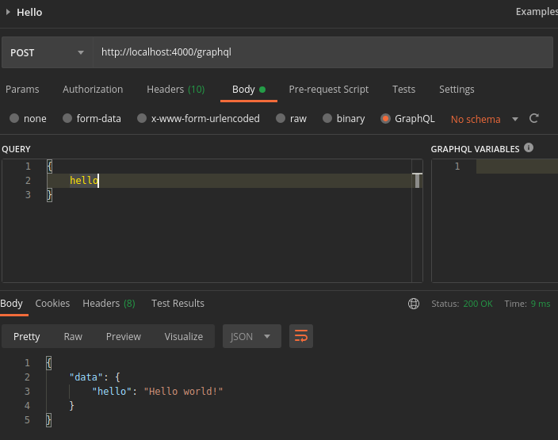

# Graphql HelloWorld

## 1. Install the program

```shell
npm install
```

## 2. Run the program

```shell
npm run start
```

## 3. Open Graphql playground in the browser

```html
http://localhost:4000/graphql
```

## 4. Test the hello query in playground

```
{
    hello
}
```

And get the next result:

{
  "data": {
    "hello": "Hello world!"
  }
}

## 5. Test the hello query with curl:

```shell
curl 'http://localhost:4000/graphql' -H 'Content-Type: application/json' -H 'Accept: application/json' --data '{"query":"{ hello }"}'
```

## 6. Test the hello query with postman





