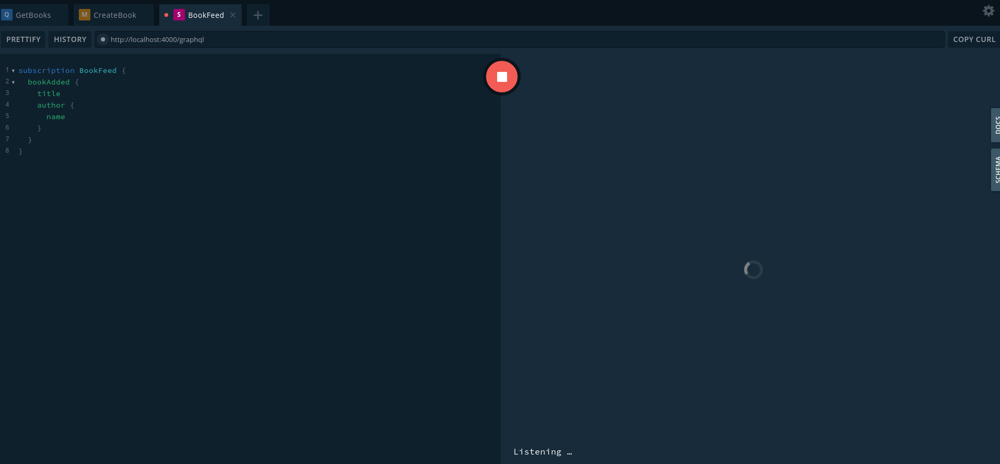
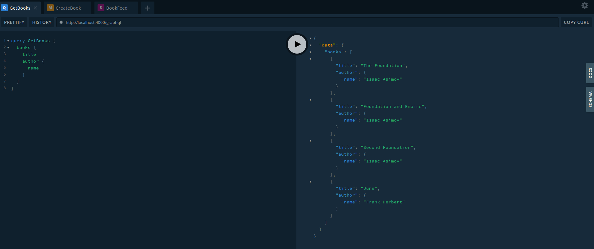
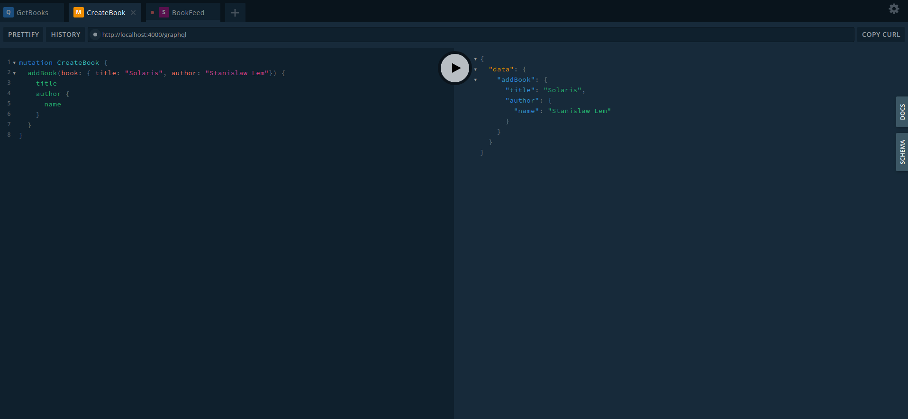
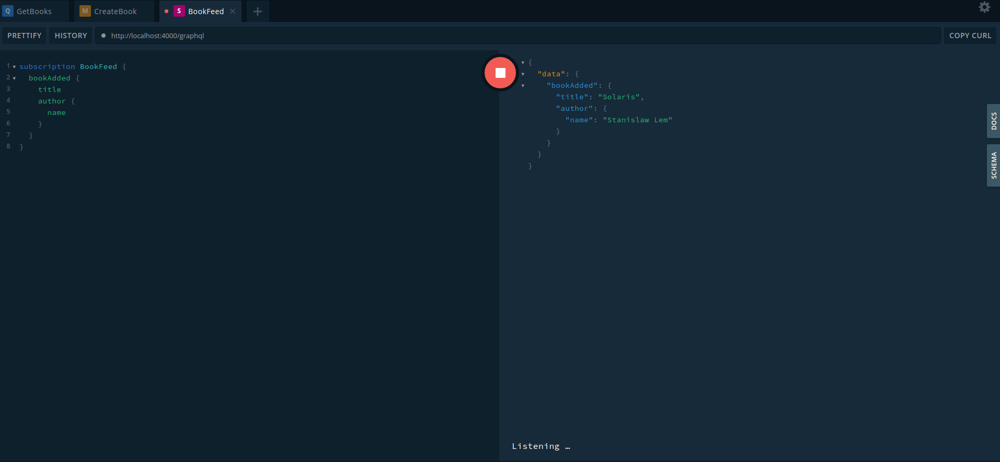

# ApolloServer - Adding Subscriptions

## 1. Install the program

```shell
npm install
```

## 2. Run the program

```shell
npm run start

Server ready at http://localhost:4000/graphql
Subscriptions ready at ws://localhost:4000/subscriptions
```

## 3. Open Graphql playground in the browser

```html
http://localhost:4000/graphql
```

## 4. Working with Subscriptions

### 4.1 Schema

Create a subscription

```graphql
type Subscription {
    bookAdded: Book
  }
```

### 4.2 Resolver

Add the PubSub and initialize it:

```javascript
const { ApolloServer, gql, PubSub } = require('apollo-server-express');

const pubsub = new PubSub();
```

Create the subscription resolver

```javascript
Subscription: {
  bookAdded: {
    subscribe: () => {
      console.log('Entering in bookAdded Subscription');
      return pubsub.asyncIterator(['BOOK_ADDED']);
    },
  },
},
```

### 4.3 Publish the event

We will publish the event in the book creation:

```javascript
Mutation: {
  addBook: (parent, args) => {
    const book = {
      title: args.book.title,
      author: {
        name: args.book.author,
      },
    };
    console.log('publishing the event BOOK ADDED');
    pubsub.publish('BOOK_ADDED', { bookAdded: book });
    books.push(book);
    return book;
  },
},
```

### 4.4 Start the server with the websockets enabled

```javascript
const app = express();

const apollo = new ApolloServer({
  subscriptions: {
    path: '/subscriptions',
  },
  typeDefs,
  resolvers,
});

apollo.applyMiddleware({ app });

const httpServer = createServer(app);

apollo.installSubscriptionHandlers(httpServer);

httpServer.listen({ port: 4000 }, () => {
  console.log(`Server ready at http://localhost:4000${apollo.graphqlPath}`);
  console.log(`Subscriptions ready at ws://localhost:4000${apollo.subscriptionsPath}`);
});
```

Note that we have changed the default path for subscriptions /graphql to /subscriptions.

## 5. Available graphql methods in playground

Get Books

```graphql
query GetBooks {
  books {
    title
    author {
      name
    }
  }
}
```

Create Book

```graphql
mutation CreateBook {
  addBook(book: { title: "Solaris", author: "Stanislaw Lem"}) {
    title
    author {
      name
    }
  }
}
```

Book feed (a subscription to creation of a book)

```graphql
subscription BookFeed {
  bookAdded {
    title
    author {
      name
    }
  }
}
```

## 6. Test the program

First, we need in playground to execute the subscription __BookFeed__. The playground will start listening events.



Then, execute the query __GetBooks__



Now, we create a new book, executing the mutation



And finally, check the subscription result:


