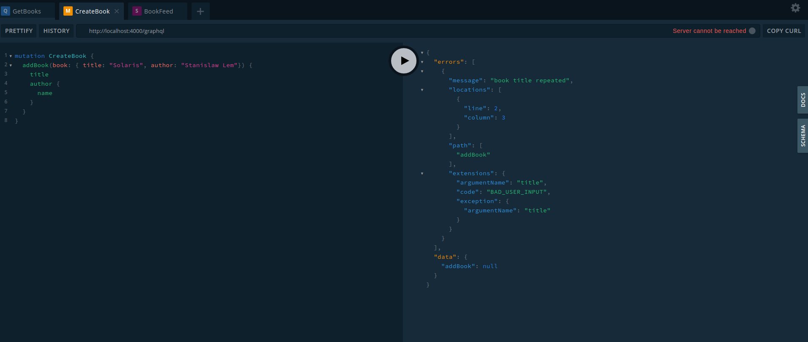

# ApolloServer - Error Handling

## 1. Install the program

```shell
npm install
```

## 2. Run the program

```shell
npm run start

Server ready at http://localhost:4000/graphql
Subscriptions ready at ws://localhost:4000/subscriptions
```

## 3. Open Graphql playground in the browser

```html
http://localhost:4000/graphql
```

## 4. Error handling

Basic error handling:

First, import the UserInputError

```javascript
const {
  ApolloServer, gql, PubSub, UserInputError,
} = require('apollo-server-express');
```

Then, in the mutation addBook, check the condition when a book title is repeated in database

```javascript
Mutation: {
    addBook: (parent, args) => {
      if (books.find((e) => e.title === args.book.title)) {
        throw new UserInputError('book title repeated', { argumentName: 'title' });
      }
      const book = {
        title: args.book.title,
        author: {
          name: args.book.author,
        },
      };

      console.log('publishing the event BOOK ADDED');
      pubsub.publish('BOOK_ADDED', { bookAdded: book });
      books.push(book);
      return book;
    },
  },
```

If execute the add book with the same title, we will obtain this response in playground:

```json
{
  "errors": [
    {
      "message": "book title repeated",
      "locations": [
        {
          "line": 2,
          "column": 3
        }
      ],
      "path": [
        "addBook"
      ],
      "extensions": {
        "argumentName": "title",
        "code": "BAD_USER_INPUT",
        "exception": {
          "argumentName": "title",
          "stacktrace": [
            "UserInputError: book title repeated",
            "    at addBook (/home/diego/workdir/nodejs_lab/34-Graphql-ApolloServer-ErrorHandling/index.js:96:15)",
            "    at field.resolve (/home/diego/workdir/nodejs_lab/34-Graphql-ApolloServer-ErrorHandling/node_modules/apollo-server-core/dist/utils/schemaInstrumentation.js:52:26)",
            "    at resolveField (/home/diego/workdir/nodejs_lab/34-Graphql-ApolloServer-ErrorHandling/node_modules/graphql/execution/execute.js:464:18)",
            "    at /home/diego/workdir/nodejs_lab/34-Graphql-ApolloServer-ErrorHandling/node_modules/graphql/execution/execute.js:261:18",
            "    at /home/diego/workdir/nodejs_lab/34-Graphql-ApolloServer-ErrorHandling/node_modules/graphql/jsutils/promiseReduce.js:23:10",
            "    at Array.reduce (<anonymous>)",
            "    at promiseReduce (/home/diego/workdir/nodejs_lab/34-Graphql-ApolloServer-ErrorHandling/node_modules/graphql/jsutils/promiseReduce.js:20:17)",
            "    at executeFieldsSerially (/home/diego/workdir/nodejs_lab/34-Graphql-ApolloServer-ErrorHandling/node_modules/graphql/execution/execute.js:258:37)",
            "    at executeOperation (/home/diego/workdir/nodejs_lab/34-Graphql-ApolloServer-ErrorHandling/node_modules/graphql/execution/execute.js:236:55)",
            "    at executeImpl (/home/diego/workdir/nodejs_lab/34-Graphql-ApolloServer-ErrorHandling/node_modules/graphql/execution/execute.js:116:14)"
          ]
        }
      }
    }
  ],
  "data": {
    "addBook": null
  }
}
```

We can avoid the stackTrace setting the NODE_ENV environment variable to __production__ or __test__. Probably you don't want to expose it to clients in production


