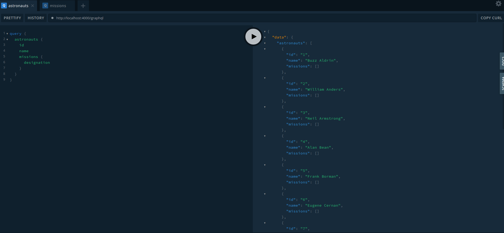
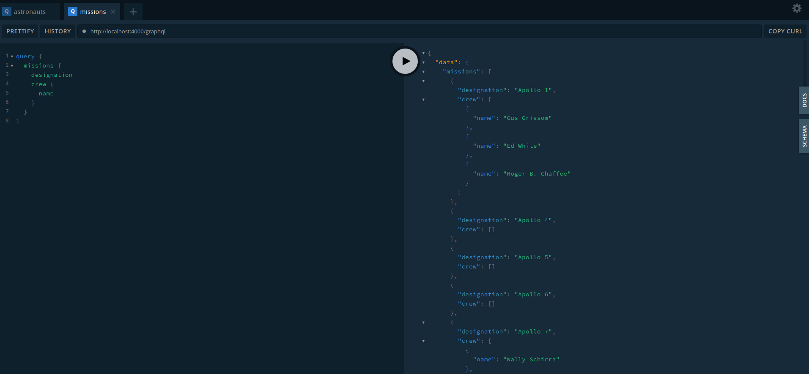

# ApolloFederation - Astronauts & Missions

## 1. Install the program

```shell
npm install
```

## 2. Run the program

Start the servers that we need to this example:

```shell
npm run server
```

The script in package.json will start all servers using the library __concurrently__

```json
"server": "concurrently -k npm:server:*",
"server:rest": "json-server -q db.json",
"server:missions": "nodemon missions.js",
"server:astronauts": "nodemon astronauts.js",
"server:graphql": "nodemon index.js",
```

This will start the next servers:

### 2.1 Api Rest

At port __3000__ we have the api rest that will serve astronauts and missions.

You can check it using:

```shell
curl http://localhost:3000/astronauts

[
  {
    "id": 1,
    "name": "Buzz Aldrin"
  },
  {
    "id": 2,
    "name": "William Anders"
  },
  {
    "id": 3,
    "name": "Neil Armstrong"
  },
  {
    "id": 4,
    "name": "Alan Bean"
  },
```

and

```shell
curl http://localhost:3000/missions

[
  {
    "id": 1,
    "designation": "Apollo 1",
    "crew": [
      14,
      30,
      7
    ],
    "startDate": null,
    "endDate": null
  },
  {
    "id": 2,
    "designation": "Apollo 4",
    "crew": [],
    "startDate": "1967-11-09T12:00:01.000Z",
    "endDate": "1967-11-09T20:37:00.000Z"
  },
```

### 2.2 Apollo Gateway

At port __4000__ we have the Apollo Gateway server, implemented in __index.js__ file

### 2.3 Astronauts Service

At port __4001__ we have the Astronauts Service

### 2.4 Missions Service

At port __4002__ we have the Missions Service

## 3. Playground

### 3.1 Queries

```graphql
query {
  astronauts {
    id
    name
    missions {
      designation
    }
  }
}
```

```graphql
query {
  missions {
    designation
    crew {
      name
    }
  }
}
```

### 3.2 Results

Results of astronauts query



Results of missions query


